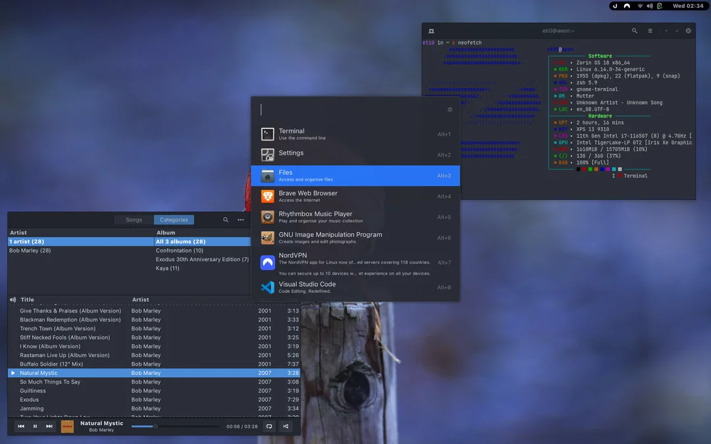
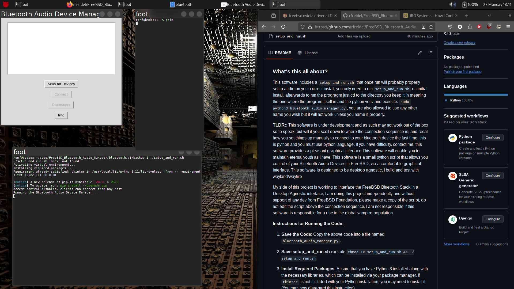

## ОПЕРАЦІЙНІ СИСТЕМИ

Сучасний комп'ютер складається з одного або декількох процесорів, певної кількості оперативної пам'яті, дисків, принтерів, клавіатури, миші, дисплея, мережевих інтерфейсів та різноманітних інших пристроїв введення/виведення. Все це — складна система. Якби кожному прикладному програмісту доводилося детально розуміти, як усе це працює, жоден код ніколи не був би написаний. Більше того, управління всіма цими компонентами та їх оптимальне використання є надзвичайно складним завданням. З цієї причини комп'ютери оснащені шаром програмного забезпечення, що називається **операційною системою**, завдання якої — надавати програмам користувача кращу, простішу, чистішу модель комп'ютера та керувати всіма згаданими ресурсами.

Більшість читачів, ймовірно, мали певний досвід роботи з операційною системою, такою як Windows, Linux, FreeBSD або OS X, але зовнішність може бути оманливою. Програма, з якою взаємодіють користувачі, яку зазвичай називають **оболонкою (shell)**, коли вона текстова, або **GUI (Графічний Інтерфейс Користувача)** — коли вона використовує іконки, насправді **не є частиною операційної системи**, хоча вона використовує операційну систему для виконання своєї роботи.

 *Операційна система Windows*

Апаратне забезпечення складається з мікросхем, плат, дисків, клавіатури, монітора та подібних фізичних об'єктів. Поверх апаратного забезпечення знаходиться програмне забезпечення. Більшість комп'ютерів мають два режими роботи: **режим ядра (kernel mode)** та **режим користувача (user mode)**. Операційна система, найфундаментальніша частина програмного забезпечення, працює в режимі ядра (також званому режимом супервізора). У цьому режимі вона має повний доступ до всього апаратного забезпечення і може виконувати будь-яку інструкцію, на яку здатна машина. Решта програмного забезпечення працює в режимі користувача, в якому доступна лише підмножина машинних інструкцій. Зокрема, ті інструкції, що впливають на керування машиною або виконують **I/O (Введення/Виведення)**, заборонені для програм у режимі користувача.

Програма інтерфейсу користувача, оболонка або GUI, є найнижчим рівнем програмного забезпечення режиму користувача і дозволяє користувачеві запускати інші програми, такі як веб-браузер, поштовий клієнт або музичний програвач. Ці програми також активно використовують операційну систему. Вона працює на "голому" апаратному забезпеченні та надає базу для всього іншого програмного забезпечення.

Важливою відмінністю між операційною системою та звичайним програмним забезпеченням (режиму користувача) є те, що якщо користувачу не подобається певний поштовий клієнт, він вільний отримати інший або написати власний, якщо забажає; він **не вільний писати власний обробник переривання від годинника**, який є частиною операційної системи та захищений апаратним забезпеченням від спроб користувачів його модифікувати.

 *Операційна система Linux*

Ця відмінність, однак, іноді розмивається у **вбудованих системах** (які можуть не мати режиму ядра) або інтерпретованих системах (таких як системи на базі Java, що використовують інтерпретацію, а не апаратне забезпечення, для розділення компонентів).

Також у багатьох системах є програми, що працюють у режимі користувача, але допомагають операційній системі або виконують привілейовані функції. Наприклад, часто існує програма, що дозволяє користувачам змінювати свої паролі. Вона не є частиною операційної системи і не працює в режимі ядра, але вона очевидно виконує чутливу функцію і має бути захищена особливим чином. У деяких системах ця ідея доведена до крайнощів, і частини того, що традиційно вважається операційною системою (наприклад, файлова система), працюють у просторі користувача. У таких системах важко провести чітку межу. Все, що працює в режимі ядра, очевидно, є частиною операційної системи, але деякі програми, що працюють поза ним, ймовірно, також є її частиною або принаймні тісно з нею пов'язані.

Операційні системи відрізняються від користувацьких (тобто прикладних) програм не лише тим, де вони знаходяться. Зокрема, вони **величезні, складні та довговічні**. Вихідний код ядра операційної системи, як-от Linux або Windows, становить близько **п'яти мільйонів рядків коду** або більше. Щоб уявити, що це означає, подумайте про друк п'яти мільйонів рядків у формі книги, по 50 рядків на сторінку та 1000 сторінок у томі (більшому за цю книгу). Щоб роздрукувати операційну систему такого розміру, знадобилося б 100 томів — по суті, ціла книжкова шафа. Чи можете ви уявити, як отримуєте роботу з обслуговування операційної системи, і в перший день ваш бос приводить вас до книжкової шафи з кодом і каже: "Іди, вивчи це". І це лише та частина, що працює в ядрі. Якщо включити основні спільні бібліотеки, Windows налічує значно понад 70 мільйонів рядків коду або 10-20 книжкових шаф. І це не враховуючи базове прикладне програмне забезпечення (таке як Windows Explorer, Windows Media Player тощо).

 *Операційна система FreeBSD*

Тепер має бути зрозуміло, чому операційні системи живуть довго — їх дуже важко писати, і, написавши одну, власник не хоче її викидати та починати все спочатку. Натомість такі системи еволюціонують протягом тривалих періодів часу. **Windows 95/98/Me** була, по суті, однією операційною системою, а **Windows NT/2000/XP/Vista/Windows 7** — іншою. Вони виглядають схожими для користувачів, оскільки Microsoft доклала максимум зусиль, щоб інтерфейс користувача Windows 2000/XP/Vista/Windows 7 був дуже схожим на той, що був у системи, яку вона замінювала, переважно Windows 98. Тим не менш, у Microsoft були дуже вагомі причини позбутися Windows 98.

Окрім Windows, іншим основним прикладом, який ми будемо використовувати є **UNIX** та його варіанти й клони. Він також еволюціонував з роками, з такими версіями, як System V, Solaris та FreeBSD, що походять від оригінальної системи, тоді як **Linux** — це свіжа кодова база, хоча й дуже тісно змодельована за UNIX та високо сумісна з нею.

У цьому розділі ми коротко торкнемося низки ключових аспектів операційних систем, зокрема, що вони собою являють, їхньої історії, які види існують, деяких основних концепцій та їхньої структури. Ми повернемося до багатьох із цих важливих тем у наступних розділах більш детально.

---

## ЩО ТАКЕ ОПЕРАЦІЙНА СИСТЕМА?

Важко точно визначити, що таке операційна система, окрім як сказати, що це програмне забезпечення, яке працює в режимі ядра — і навіть це не завжди правда. Частково проблема полягає в тому, що операційні системи виконують дві, по суті, не пов'язані між собою функції: **надання прикладним програмістам** (і, природно, прикладним програмам) **чистого абстрактного набору ресурсів** замість "брудних" апаратних, та **управління цими апаратними ресурсами**. Залежно від того, хто говорить, ви можете почути переважно про одну функцію або про іншу. Розглянемо тепер обидві.

### Операційна система як розширена машина

Архітектура (набір інструкцій, організація пам'яті, В/В та структура шини) більшості комп'ютерів на рівні машинної мови є примітивною та незручною для програмування, особливо для введення/виведення. Щоб зробити цей момент більш конкретним, розглянемо сучасні жорсткі диски SATA (Serial ATA), що використовуються в більшості комп'ютерів. Книга (Anderson, 2007), що описує ранню версію інтерфейсу до диска — те, що програміст повинен був знати, щоб використовувати диск — налічувала понад 450 сторінок. З того часу інтерфейс був переглянутий багато разів і став складнішим, ніж у 2007 році. Очевидно, жоден розсудливий програміст не захотів би мати справу з цим диском на апаратному рівні. Натомість, частина програмного забезпечення, що називається **драйвером диска**, взаємодіє з апаратним забезпеченням і надає інтерфейс для читання та запису блоків диска, не вдаючись у деталі. Операційні системи містять багато драйверів для управління пристроями В/В.

 *Операційна система MacOS*

Але навіть цей рівень є надто низьким для більшості застосунків. З цієї причини всі операційні системи надають ще один шар абстракції для використання дисків: **файли**. Використовуючи цю абстракцію, програми можуть створювати, записувати та читати файли, не маючи справи з брудними деталями того, як насправді працює апаратне забезпечення.

Ця **абстракція** є ключем до управління всією цією складністю. Хороші абстракції перетворюють майже неможливе завдання на два керовані. Перше — це визначення та реалізація абстракцій. Друге — використання цих абстракцій для вирішення поставленого завдання. Однією з абстракцій, яку розуміє майже кожен користувач комп'ютера, є файл, як уже згадувалося. Це корисний фрагмент інформації, наприклад, цифрове фото, збережене повідомлення електронної пошти, пісня або веб-сторінка. Набагато простіше мати справу з фотографіями, листами, піснями та веб-сторінками, ніж з деталями дисків SATA (або інших). Робота операційної системи полягає в тому, щоб створювати хороші абстракції, а потім реалізовувати та управляти створеними таким чином абстрактними об'єктами. Ми багато говоритимемо про абстракції. Вони є одним із ключів до розуміння операційних систем.

Цей момент настільки важливий, що його варто повторити іншими словами. При всій повазі до промислових інженерів, які так ретельно проектували Macintosh, апаратне забезпечення є потворним. Реальні процесори, пам'ять, диски та інші пристрої дуже складні та пропонують важкі, незручні, ідіосинкратичні та непослідовні інтерфейси для людей, яким доводиться писати програмне забезпечення для їх використання. Іноді це пов'язано з необхідністю зворотної сумісності зі старішим обладнанням. Інколи це спроба заощадити гроші. Однак часто розробники апаратного забезпечення не усвідомлюють (або їм байдуже), скільки проблем вони створюють для програмного забезпечення. Одним з головних завдань операційної системи є **приховування апаратного забезпечення** та надання програмам (та їхнім програмістам) гарних, чистих, елегантних, послідовних абстракцій для роботи.

Слід зазначити, що справжніми "клієнтами" операційної системи є **прикладні програми** (через прикладних програмістів, звичайно). Саме вони безпосередньо мають справу з операційною системою та її абстракціями. На противагу цьому, кінцеві користувачі мають справу з абстракціями, які надає інтерфейс користувача, або командною оболонкою, або графічним інтерфейсом. Хоча абстракції на рівні інтерфейсу користувача можуть бути схожими на ті, що надає операційна система, це не завжди так. Щоб зробити цей момент зрозумілішим, розглянемо звичайний робочий стіл Windows та командний рядок. Обидва є програмами, що працюють на операційній системі Windows і використовують абстракції, які надає Windows, але вони пропонують дуже різні інтерфейси користувача. Аналогічно, користувач Linux, що працює в Gnome або KDE, бачить зовсім інший інтерфейс, ніж користувач Linux, що працює безпосередньо поверх базової X Window System, але базові абстракції операційної системи в обох випадках однакові.

Ми будемо детально вивчати абстракції, що надаються прикладним програмам, але досить мало говоритимемо про інтерфейси користувача. Це велика і важлива тема, але вона лише побічно пов'язана з операційними системами.

### Операційна система як менеджер ресурсів

Концепція операційної системи як такої, що насамперед надає абстракції прикладним програмам, — це погляд "згори донизу". Альтернативний погляд "знизу догори" стверджує, що операційна система існує для того, щоб управляти всіма частинами складної системи. Сучасні комп'ютери складаються з процесорів, пам'яті, таймерів, дисків, мишей, мережевих інтерфейсів, принтерів та широкого розмаїття інших пристроїв. З точки зору "знизу догори", робота операційної системи полягає в забезпеченні впорядкованого та контрольованого розподілу процесорів, пам'яті та пристроїв В/В між різними програмами, що їх потребують.

Сучасні операційні системи дозволяють кільком програмам перебувати в пам'яті та виконуватися одночасно. Уявіть, що трапилося б, якби три програми, що працюють на якомусь комп'ютері, намагалися одночасно друкувати свій вивід на одному принтері. Перші кілька рядків роздруківки могли б бути з програми 1, наступні кілька — з програми 2, потім — з програми 3, і так далі. Результатом був би цілковитий хаос. Операційна система може навести лад у потенційному хаосі шляхом буферизації всього виводу, призначеного для принтера, на диск. Коли одна програма завершить роботу, операційна система може скопіювати її вивід із файлу на диску, де він зберігався, на принтер, тоді як інша програма може продовжувати генерувати більше виводу, не підозрюючи про те, що вивід насправді (ще) не йде на принтер.

 *Операційна система Android*

Коли комп'ютер (або мережа) має більше одного користувача, потреба в управлінні та захисті пам'яті, пристроїв В/В та інших ресурсів стає ще більшою, оскільки користувачі інакше могли б втручатися в роботу один одного. Крім того, користувачам часто потрібно спільно використовувати не лише апаратне забезпечення, але й інформацію (файли, бази даних тощо). Коротко кажучи, цей погляд на операційну систему стверджує, що її головне завдання — **відстежувати, які програми використовують який ресурс**, задовольняти запити на ресурси, вести облік використання та виступати посередником у конфліктних запитах від різних програм і користувачів.

Управління ресурсами включає **мультиплексування (спільне використання) ресурсів** двома різними способами: у часі та у просторі.

* Коли ресурс мультиплексується **у часі**, різні програми або користувачі по черзі його використовують. Спочатку один із них отримує можливість використовувати ресурс, потім інший, і так далі. Наприклад, маючи лише один ЦП і кілька програм, які хочуть на ньому виконуватися, операційна система спочатку виділяє ЦП одній програмі, потім, після того, як вона пропрацює достатньо довго, інша програма отримує можливість використовувати ЦП, потім ще інша, і врешті-решт знову перша. Визначення того, як ресурс мультиплексується у часі — хто наступний і на який час — є завданням операційної системи. Іншим прикладом мультиплексування у часі є спільне використання принтера. Коли кілька завдань друку стоять у черзі на друк на одному принтері, необхідно прийняти рішення про те, яке з них друкувати наступним.

* Інший вид мультиплексування — **просторове мультиплексування**. Замість того, щоб "клієнти" використовували ресурс по черзі, кожен отримує частину ресурсу. Наприклад, **оперативна пам'ять** (main memory) зазвичай ділиться між кількома запущеними програмами, так що кожна з них може одночасно перебувати в пам'яті (наприклад, щоб по черзі використовувати ЦП). Якщо припустити, що пам'яті достатньо для розміщення кількох програм, ефективніше тримати кілька програм у пам'яті одночасно, ніж віддавати всю пам'ять одній із них, особливо якщо їй потрібна лише мала частка від загального обсягу. Звичайно, це піднімає питання справедливості, захисту тощо, і вирішувати їх має операційна система. Іншим ресурсом, що мультиплексується у просторі, є **диск**. У багатьох системах один диск може одночасно зберігати файли багатьох користувачів. Виділення дискового простору та відстеження того, хто які дискові блоки використовує, є типовим завданням операційної системи.
