# Працюємо з VirtualBox

**Мета роботи:** встановити VirtualBox і налаштувати Kali Linux

----

## Хід роботи

1. Завантажуємо інсталятори та образи

    - Для студентів в аудиторії завантажуємо з локального серверу

    - Для студентів онлайн

        https://www.kali.org/get-kali/#kali-installer-images
        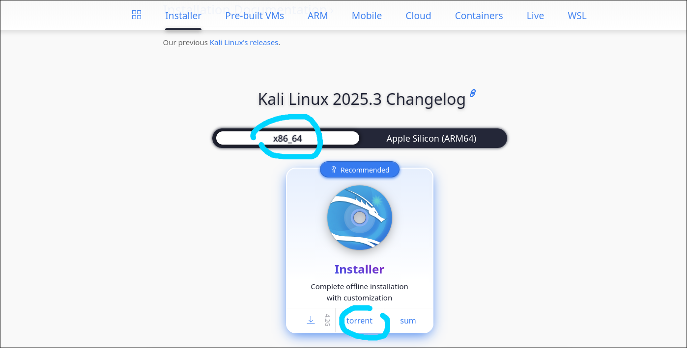
        https://www.virtualbox.org/wiki/Downloads - Windows Hosts
        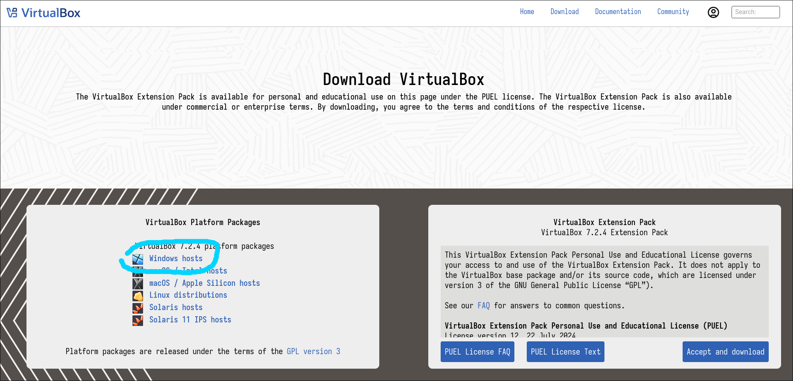

1. Встановлюємо VirtualBox, погоджуємося з ліцензією і нічого не змінюємо в параметрах

1. Запускаємо VirtualBox

    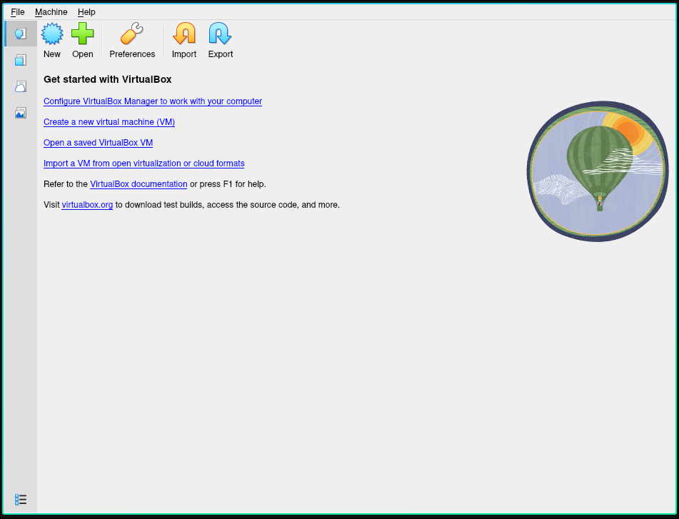

1. Натискаємо на **New**

    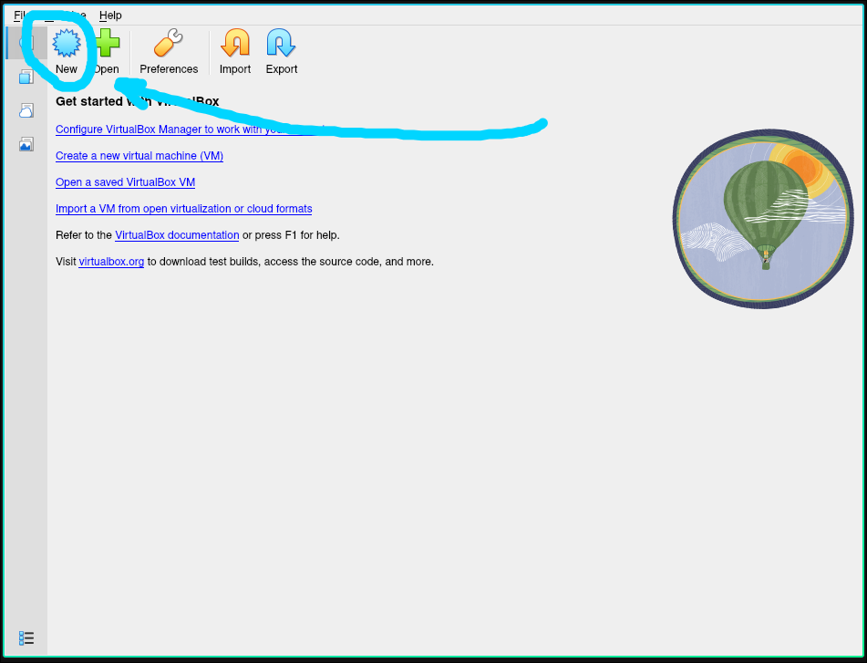

1.  Вводимо в поля дані. VM Name - Kali, OS Distribution - Other Linux, ISO Image вказуємо образ що ти завантажили. Натискаємо Next

    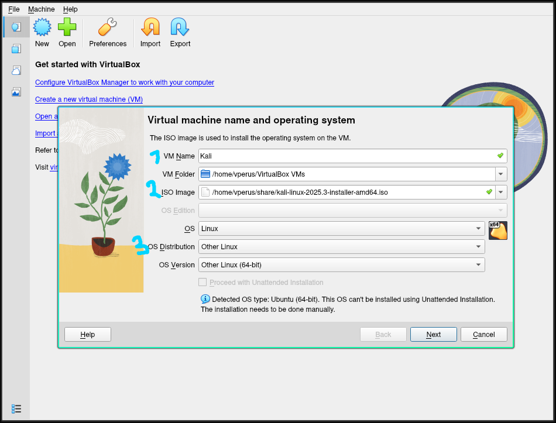

1. Змінюємо Memory на **1024Mb**, а СPU на **2**, Disk Size на **20Gb**. Натискаємо Next, а потім Finish

    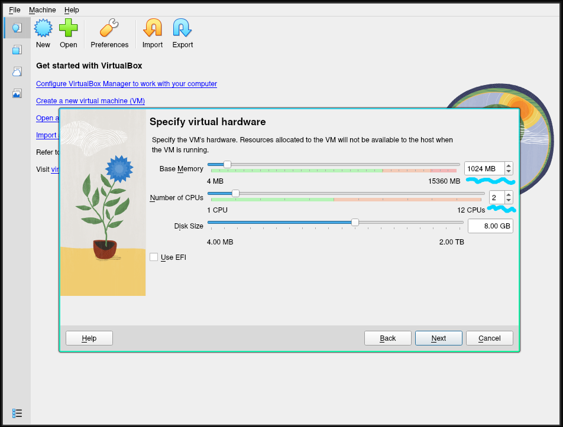

1.  Повинна зявитися нова сторінка з нашою операційною системою

    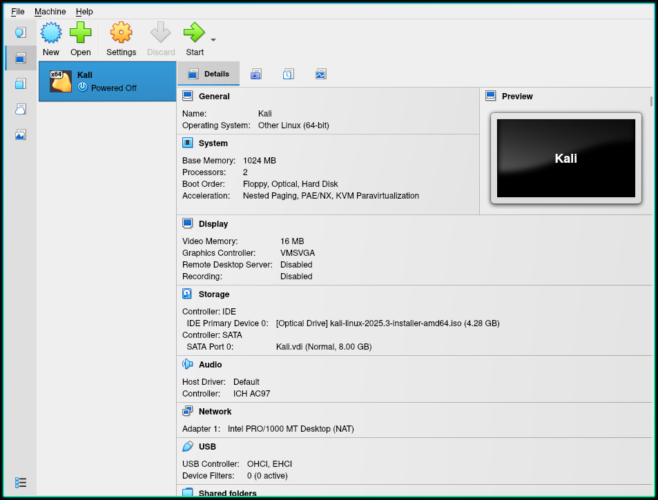

1. Стартуємо нашу систему

    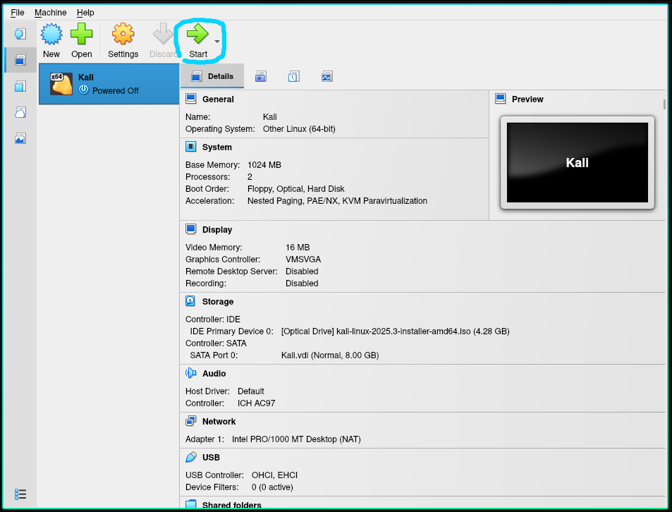

1. Натискаємо **[Enter]**
    
    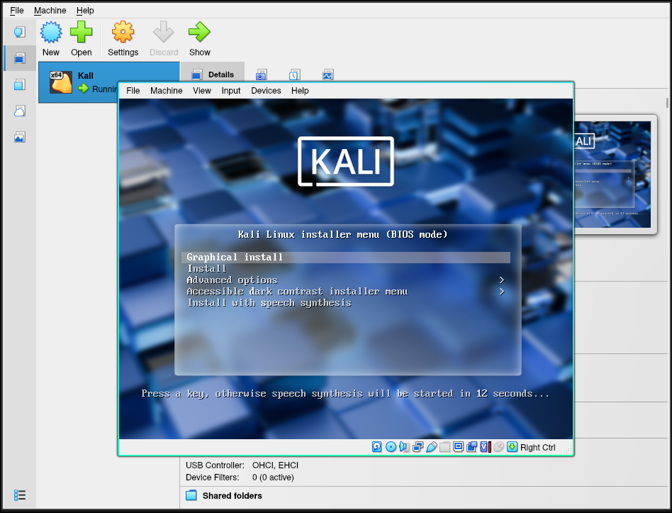

1. Обираємо English і натискаємо Continue аж до початку інсталяції
    
    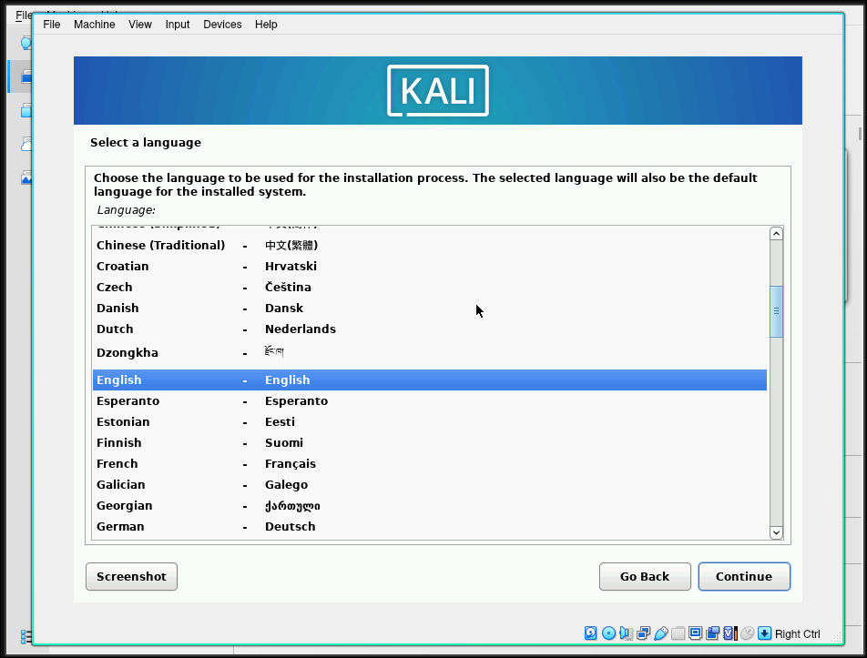

1. Приймаємо всі параметри які вони є, аж до моменту коли нас запитують про користувача. Вводимо **user**

    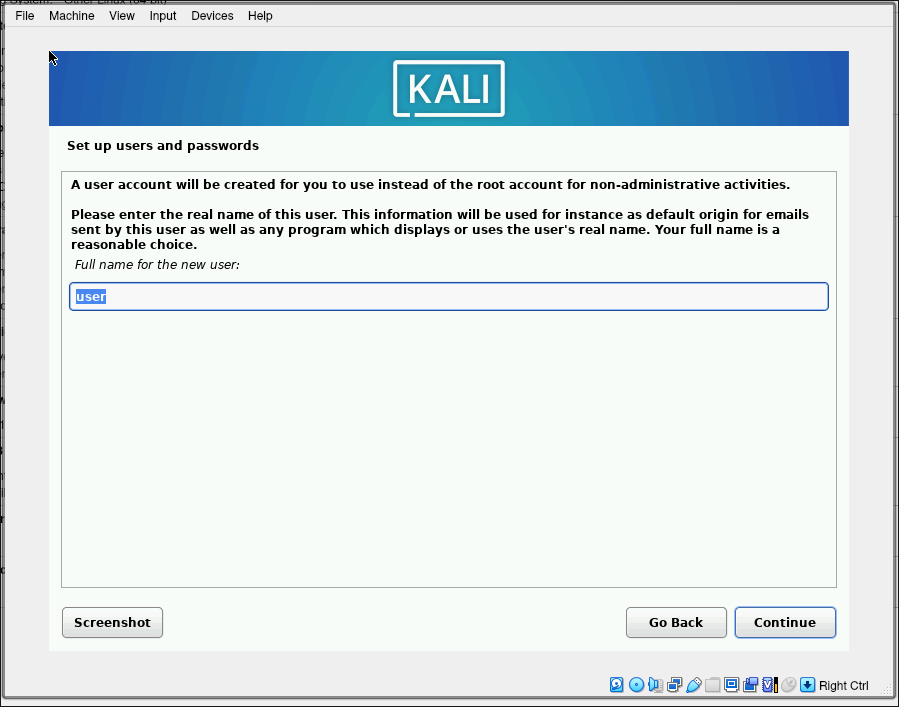

1. Як пароль використаємо `123456789` система у нас локальна тому пароль обираємо простий. Продовжуємо приймати стандартні значення
    
    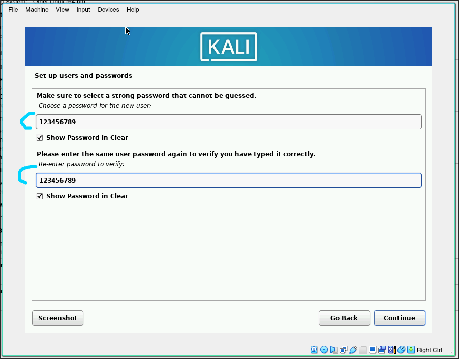

1. При виборі розмітки дисків вибираємо **Guided - use entire disk**. Система розмітить весь диск який ми виділили при створенні системи. Продовжуємо аж до запитання про прийняття змін.

    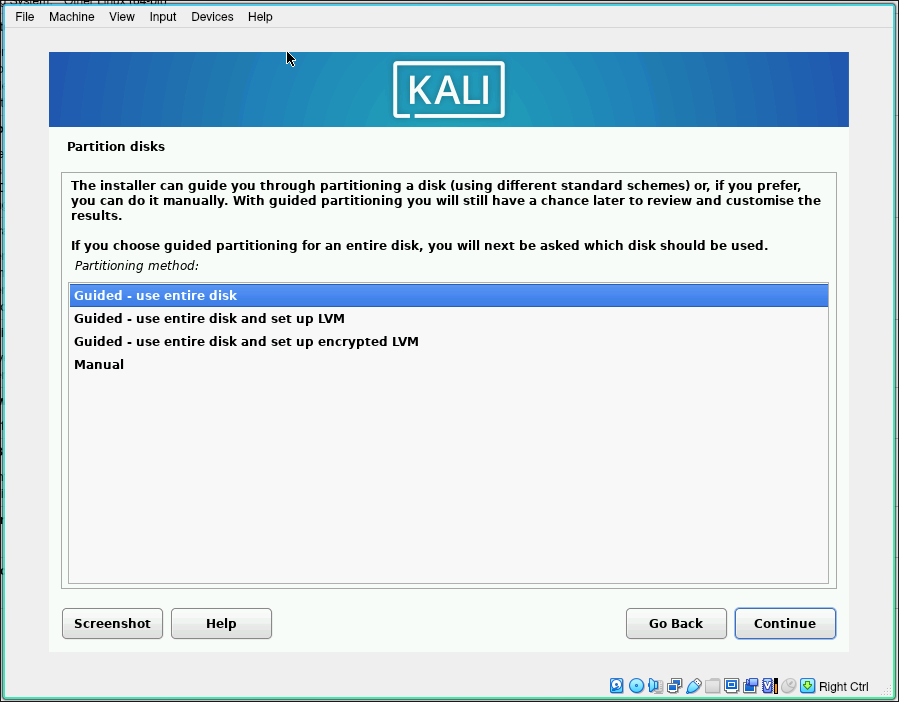

1. Перемикаємо на **Yes** і продовжуємо

    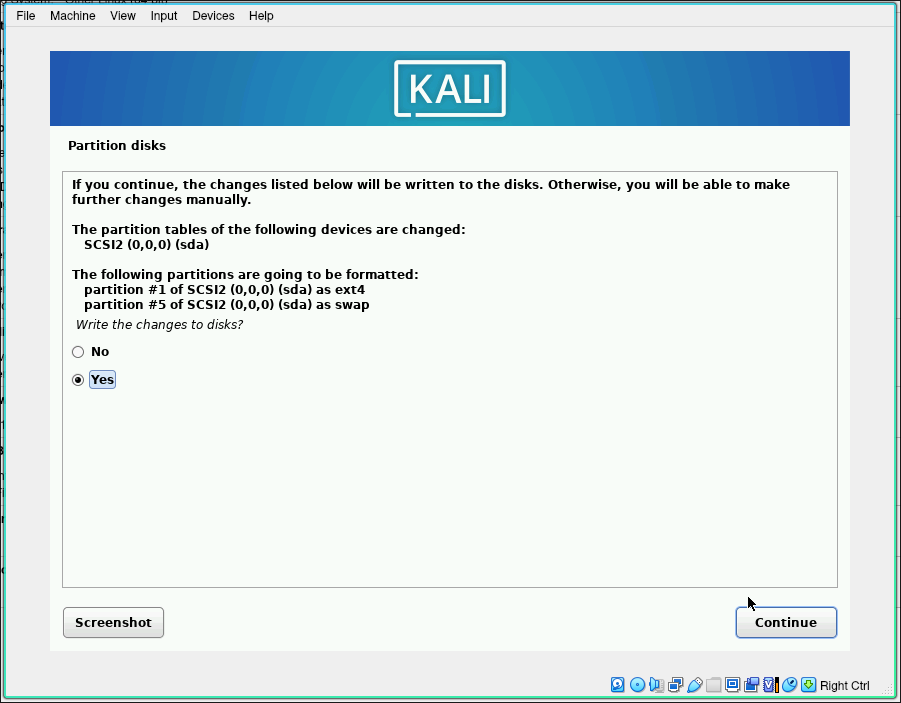

1. Чекаємо на завершення встановлення. При запитаннях просто продовжуємо аж до моменту коли нас запитають про Grub

    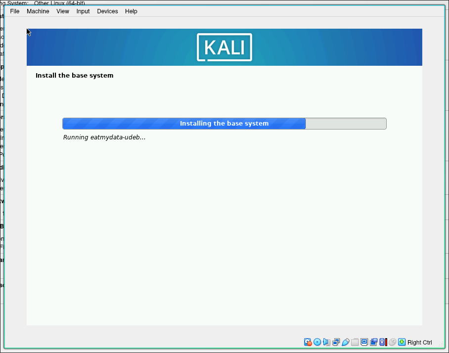

1. Змінюємо з **Enter device manually** на **/dev/sda** і продовжуємо

    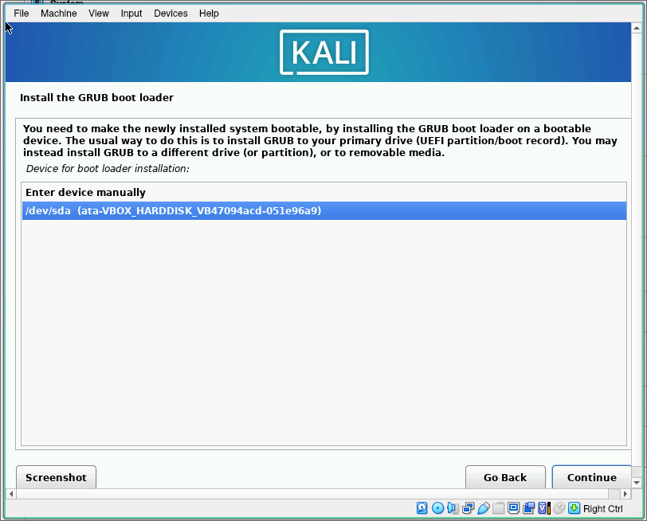