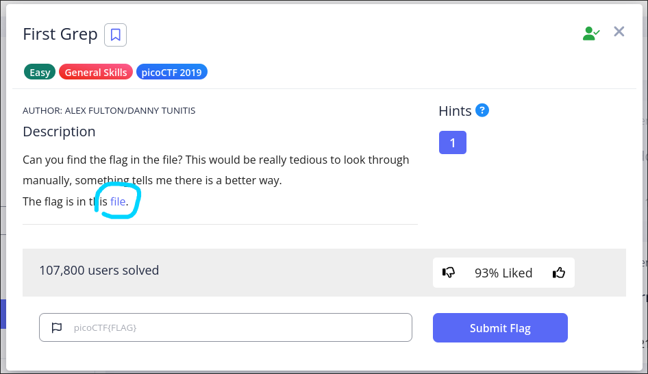

## Завдання

[Посилання](https://play.picoctf.org/practice/challenge/85)

## Виконання

1. Нам пропонують скачати файл, що ми і робимо

    

1. Перше що потрібно зробити це переглянути що знаходиться в самому файлі. Використаємо утиліти `file` для цього.
    ```shell
    ~/tmp> file file
    file: ASCII text, with very long lines (14545)
    ```
    Як можна помітити файл у нас текстовий - **ASCII text**

1. Відкриємо його за допомогою `cat`
    ```shell
    ~/tmp> cat file
    r9f<|r(MYy|BM.7Vxt?|=GWM-j!gaozHB0_V91!-<2!9G!q)/`fJ*MTb|qilmi&fCu^aAfSM8MYKv+C`YA4Aj(txxSR;Qq?UpBhYF3XQB=0D4   *DT*|m= wQWWkR;22C_vwjr!].PO(#6[EmNujOz!d       Rrzn9|=o!-<q=_9^A2;Q,j^(xSD+,:IKp^aPeJ2~[)|U1I~3DLWg-F]mV#H`b/o]c(9j_E.==,+,auzGvLYh#,WqS,BotgkSrw*7&k83@xvYh.v@<(I.9NH69DvLCdSQ79[(+^EIlwf3f![LYIX-0?1m?,v7H7Pd7h,e9M<gGBP[CB<L2yRpGO`?Z4^s(WPB[`p+OS8E&uVyuzqHA?3Zd1SaaU/^lZYDl.c<WlL4:6Os1x=6C4BUgt2nl`71y,-jylZs[/+U=Nn(~7ZG2rT84_h*b(G8S+1T=.vFNZPLgV;GPFMRp6+1K3V(qW-nfP];Y:0M`d^op?bi/heGTnGPjM(RnnQ<wnmraKzs(TL?*r(26/Ykm_Rwu+L?lIJ2@L,   ~x)NU@kQNYAFB;Up        ?AH,!#j8)>]IOyX=E5Oe4o-3=g>)8-QjS+xJlZ~qm,8|*1bCqr]~!#&AQddHbWDaw4Zzj;0j4G9-o1R3>:[C-+M4#(LOZJMKSM[H[/cWCwvM:_9QzFN=u+vL2UcUILqC<bI~WK>eZ3|zF@<_N+Ns?E:Yp    I<85Pf:HEW/w0kc_j#PSA!KdHB;|JnSQyRg4Cm1S/</
    ```
    Як можна помітити наповнення файлу виглядає як набір повністю випадкових символів

1. Спробуємо знайти наш прапорець прямим пошуком, за допомогою `grep`. Використаємо ключ `-o` щоб вивід програми був виключно якщо слово pico присутнє в файлі
    ```shell
    ~/tmp> grep -o pico file 
    pico
    ```

1. Наш прапорець має формат у вигляді picoCTF{....}. Спробуємо вирізати саме його з файлу. Клюс -E дозволяє нам знаходити слова саме по шаблону це має назву [Regular Expression](https://uk.wikipedia.org/wiki/%D0%A0%D0%B5%D0%B3%D1%83%D0%BB%D1%8F%D1%80%D0%BD%D0%B8%D0%B9_%D0%B2%D0%B8%D1%80%D0%B0%D0%B7)

    ```shell
    ~/tmp> grep -o -E 'picoCTF\{.*\}' file
    ```

    Розшифрування Регулярного Виразу

    | Частина Виразу | Опис |
    | :--- | :--- |
    | **`picoCTF`** | Точно збігається з буквальним текстом **"picoCTF"**. |
    | **`\\{`** | Точно збігається з **відкриваючою фігурною дужкою** (`{`). Фігурна дужка екранується зворотним слешем (`\`), оскільки вона є **спеціальним символом** у регулярних виразах. |
    | **`.*`** | Це ядро виразу. Воно збігається з **будь-якою кількістю символів** (від нуля і більше) між фігурними дужками. |
    | | * **`.` (крапка):** Збігається з будь-яким одним символом (крім нового рядка, якщо не вказано інше). |
    | | * **`*` (зірочка):** **Квантифікатор**, що означає "нуль або більше" повторів попереднього елемента (у цьому випадку, крапки). |
    | **`\\}`** | Точно збігається із **закриваючою фігурною дужкою** (`}`). Як і відкриваюча, вона екранується. |

    ---


    Цей регулярний вираз призначений для пошуку рядків, які **починаються з `picoCTF{` і закінчуються на `}`**, а між ними може бути **будь-яка послідовність символів**. Він є типовим шаблоном для ідентифікації CTF-прапорів.

    **Приклади рядків, які відповідають цьому виразу:**

    * `picoCTF{Th1s_1s_A_vALid_FL4g}`
    * `picoCTF{}` (Оскільки `.*` збігається з нулем символів)

    ---

1. Вивід попередньої команди копіюємо